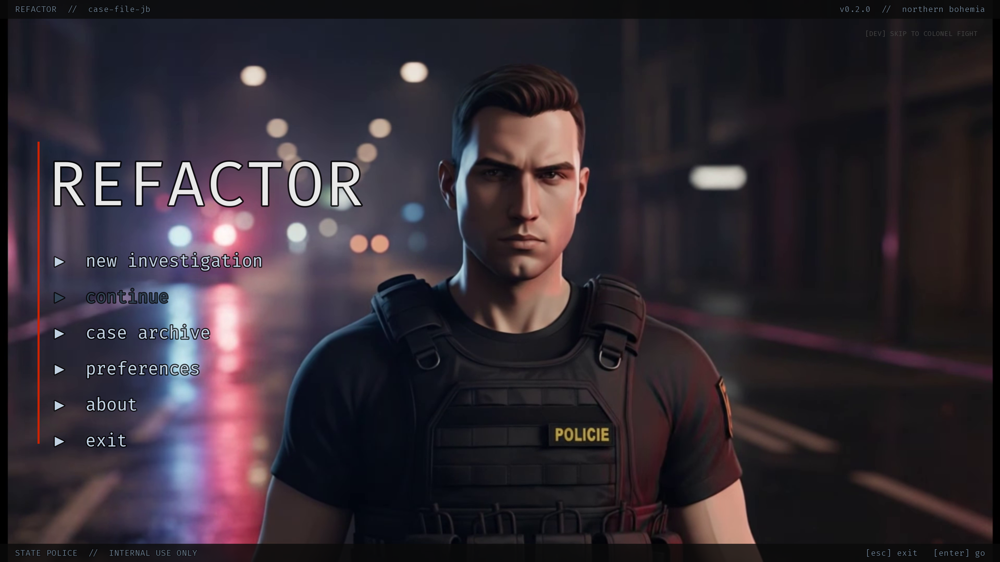
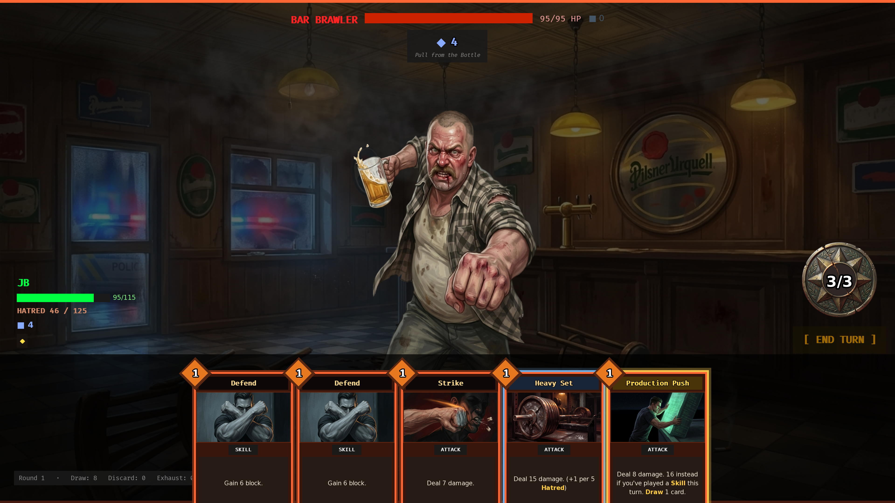
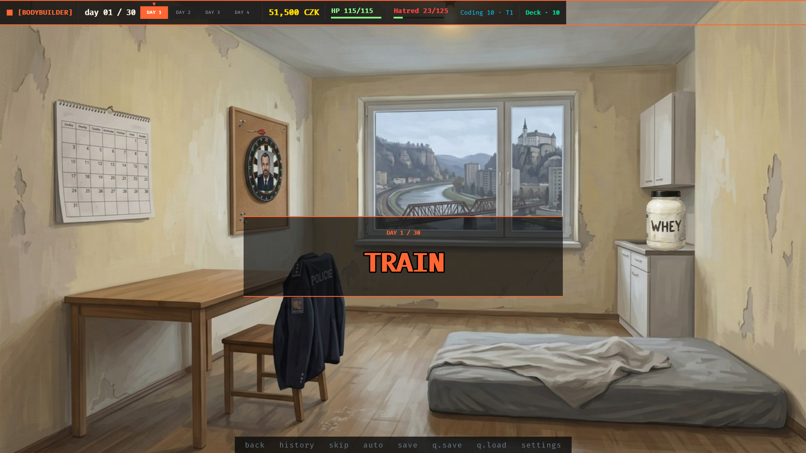
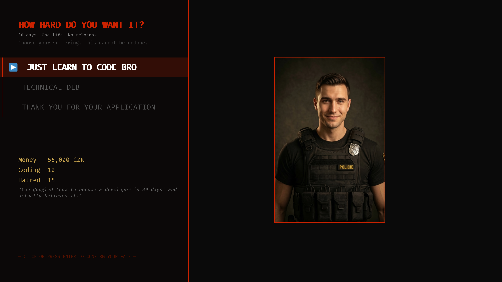

# REFACTOR

> *"Code your way out, or lose your mind trying."*

**REFACTOR** is a deckbuilder–life-sim set in Northern Bohemia. You play as JB, a Czech cop on a 30-day countdown to a confrontation with his commanding officer - the Colonel - clawing his way out of policing and into software.

The hook: **the deck you fight with is the 30 days you lived.** There is no curated card pool handed to you. Every day is a resource decision, and every decision writes a card into your deck. 

It's a Slay-the-Spire inspired roguelike with a life-sim mechanics baked in.

  

---

## Preview

  
   <i>Turn-based card combat. Every fight is a Northern-Bohemia police case.</i>

  
   <i>The daily hub — JB's flat in Děčín.</i>

  
   <i>Some of the enemies you can meet during your playthrough.</i>

---

## The 30-day loop

Each day you pick **one move**. Activities don't just shift stats — they seed cards into your deck:

| Activity | What it does |
|---|---|
| **Gym** |  Upgrade a card, or heal and raise max HP. |
| **Coding** | Raises coding skill — your escape velocity. |
| **Bouncer** | Your way to get some quick cash. Pays well; dangerous for a cop. |
| **Overtime** | Trade time for money: +5,000 CZK, +15 hatred. Plenty of random events can heppen here. |

Three stats run the campaign:

- **Money (CZK)** — pays for items, cards or skipping fights entirely. Hit zero and you're on the street.
- **Coding Skill** — your way out, and it reaches into battle.
- **Hatred** — climbs every night. Hit the cap and JB breaks.

Your need to balance both your deck's strenght and your stats — there is no single winning strategy.

---

## Combat — the battle ladder

A dozen-plus turn-based card battles are spread across the 30 days, each framed as a Northern-Bohemia police case: a market bust, a staging-lot standoff, an internal-affairs interrogation. 

You can complete this game without defeating a single enemy if that's your style.

---

## Classes

- **Bodybuilder** — FULLY playable: Increased hatred cap (100 -> 125), "Juggernaut/Berserk" class. You are pretty strong, but it comes at the price of slower coding. Your activities are: Gym, Bouncer, Coding and Overtime.
- **Dark Empath** — IN DEVELOPMENT. 
- **Biohacker** — PREVIEW available. Nootropics are your strongest weapons, you learn coding much faster. Your activities are: Recovery, Stack, Coding and Overtime.

The class you pick is permanent and reshapes the daily loop, the deck you can build, and how the Colonel fight goes. 

 

---

## Endings

- **Good Ending** — you made it out... <i>or did you?</i>
- **True Ending** — you finished it - <i>once and for all</i>

---

## Tone

Dark comedy meets existential dread. JB isn't a victim who cries about his failures — he's a man trapped in a broken system who decides to fight his way out. The humor is dry, the stakes are real, and the bureaucracy is the true antagonist. 

---

## Tech

- **Engine:** Ren'Py 8 — Python game logic in `init python` blocks
- **Architecture:** modular `.rpy` codebase — daily loop, stat model, deck/battle engine, and content split across separate files
- **Content:** 70+ cards across multiple archetypes; a dozen-plus enemy ladder.
- **Art:** AI-generated and hand-curated (Nano Banana / Gemini pipeline)
- **Music:** original AI-generated tracks

Currently three difficulties are available: Easy, Medium, Insane

---

## Run it

1. Download [Ren'Py 8](https://www.renpy.org/latest.html)
2. Add the `REFACTOR/` folder as a project in the Ren'Py launcher
3. Launch

---

## Credits

**Developer:** Jakub Barák

*"Police officers preserve the status quo. Developers build the future."*
