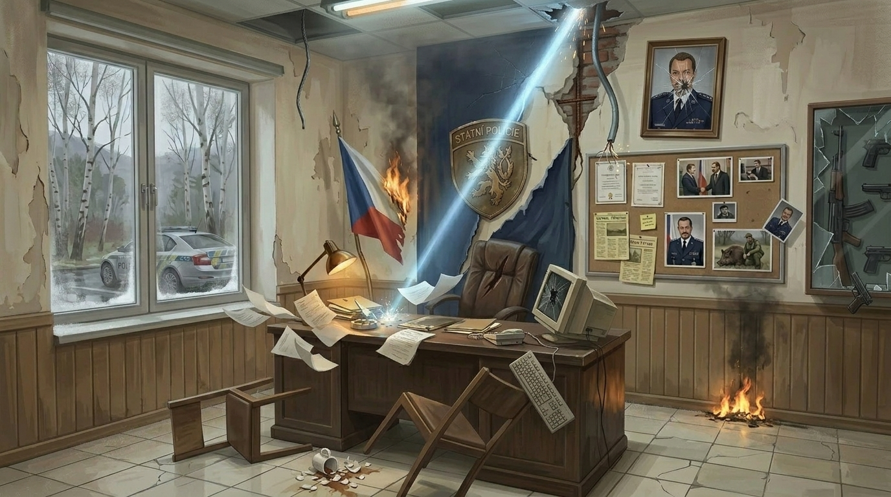
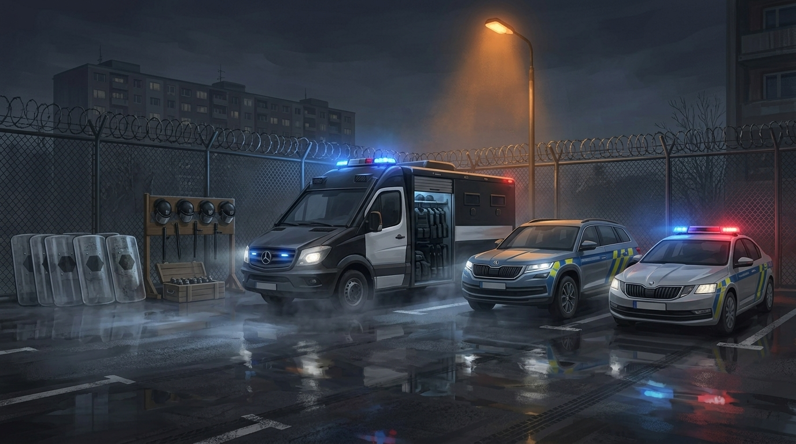
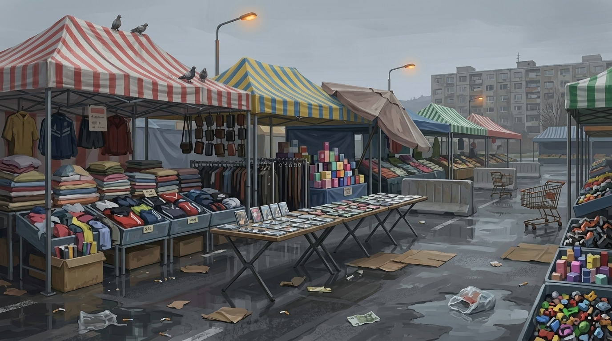
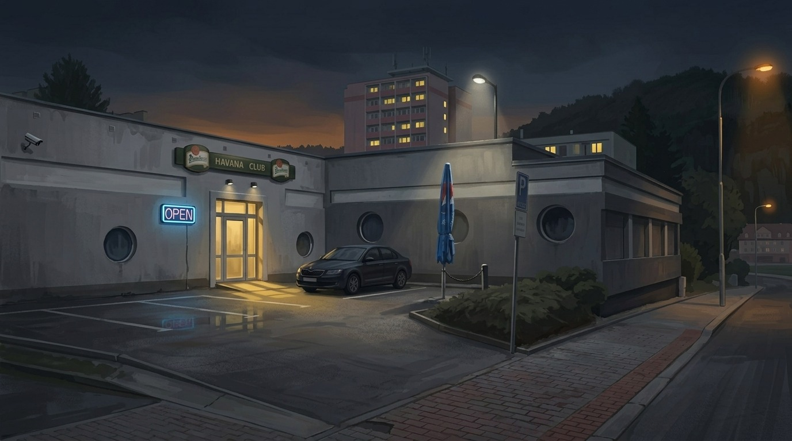

# REFACTOR

> *"Code your way out, or lose your mind trying."*

**REFACTOR** is a deckbuilder–life-sim set in Northern Bohemia. You play JB, a Czech cop on a 30-day countdown to a confrontation with his commanding officer — the Colonel — clawing his way out of policing and into software.

The hook: **the deck you fight with is the 30 days you lived.** There is no curated card pool handed to you. Every day is a resource decision, and every decision writes a card into your deck. The Colonel fight is the reckoning for the deck — and the man — those 30 days produced.

It's a Slay-the-Spire-shaped roguelike with a life-sim front half. Not a visual novel.

  
   <i>The Colonel's office — the cracks in the wall, and in the system.</i>

---

## Preview

<table>
  <tr>
    <td width="50%"> <i>A police staging lot — one node on the battle ladder.</i></td>
    <td width="50%"> <i>The market — another Northern-Bohemia case to close.</i></td>
  </tr>
  <tr>
    <td width="50%"> <i>The gym — where you forge and upgrade cards.</i></td>
    <td width="50%"> <i>The Havana Club — moonlighting a cop shouldn't be doing.</i></td>
  </tr>
</table>

---

## The 30-day loop

Each day you pick **one move**. Activities don't just shift stats — they seed cards into your deck:

| Activity | What it does |
|---|---|
| **Gym** | Train. Upgrade a card, or heal and raise max HP. |
| **Coding** | Freelance / Coach / Bootcamp. Raises coding skill — your escape velocity. |
| **Bouncer** | High-risk cash at the club. Pays well; dangerous for a cop. |
| **Night Shift** | Trade time for money: +5,000 CZK, +15 hatred. |

Three stats run the campaign:

- **Money (CZK)** — pays for coaching, courses, recovery. Hit zero and you're on the street.
- **Coding Skill** — your way out, and it reaches into battle.
- **Police Hatred (PČR)** — climbs every night. Hit 100 and JB breaks.

Story beats fire on fixed days; opportunity events appear at random. Your choices compound — there is no single winning strategy.

---

## Hatred corrupts your deck

Hatred isn't only a fail bar. As it climbs, **involuntary Rage cards** get jammed into your deck — high damage, self-corrupting (self-damage, hand discard, block-strip). A "hot" run hits hard and runs unstable. The Colonel weaponizes your own hatred against you.

---

## Combat — the battle ladder

A dozen-plus turn-based card battles are spread across the 30 days, each framed as a Northern-Bohemia police case: a market bust, a staging-lot standoff, an internal-affairs interrogation. A day slot rolls **either** a battle node or a narrative event.

Each fight uses conventional HP. **Losing is not game over** — it triggers a *forced detour* (hospital, suspension, debt) with its own choices and cost. Stack up enough stalls and the run degrades toward a worse ending.

**The Colonel** is the capstone — a multi-phase deck-fight whose intent escalates with your hatred, built on mechanics the ladder telegraphs but never fully shows.

---

## Classes

- **Bodybuilder** — playable. A body-and-block archetype: the gym is his card forge, and every rep is an argument.
- **Dark Empath / Biohacker** — locked previews in this build.

The class you pick is permanent and reshapes the daily loop, the deck you can build, and how the Colonel fight goes.

 

---

## Endings

Four ways the 30 days resolve:

- **Breakdown** — hatred reaches 100 before the reckoning.
- **Homeless** — money runs out.
- **Escape** — you beat the Colonel and walk out clean.
- **Reunion** — you survive the Colonel, but too broke or unskilled to truly leave.

---

## Tone

Dark comedy meets existential dread. JB isn't a victim who cries about his failures — he's a man trapped in a broken system who decides to fight his way out. The humor is dry, the stakes are real, and the bureaucracy is the true antagonist. The game doesn't moralize; it presents choices and lets the math do the talking.

---

## Tech

- **Engine:** Ren'Py 8 — Python game logic in `init python` blocks
- **Architecture:** modular `.rpy` codebase — daily loop, stat model, deck/battle engine, and content split across separate files
- **Content:** 70+ cards across multiple archetypes; a dozen-plus enemy ladder plus the Colonel capstone
- **Art:** AI-generated and hand-curated (Nano Banana / Gemini pipeline)
- **Music:** original AI-generated tracks

Currently runs on one tuned difficulty; difficulty tiers and meta-progression are post-1.0. See `docs/REFACTOR_VISION.md` for the roadmap to Steam 1.0.

---

## Run it

1. Download [Ren'Py 8](https://www.renpy.org/latest.html)
2. Add the `REFACTOR/` folder as a project in the Ren'Py launcher
3. Launch

### Controls

- **Left click / Space / Enter** — advance
- **Escape** — game menu
- **S** — screenshot · **H** — hide dialogue

---

## Credits

**Developer:** Jakub Barák

*"Police officers preserve the status quo. Developers build the future."*
